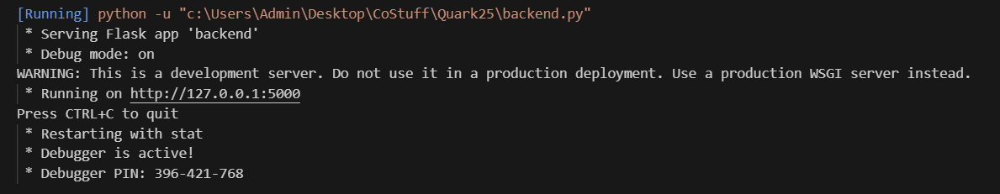
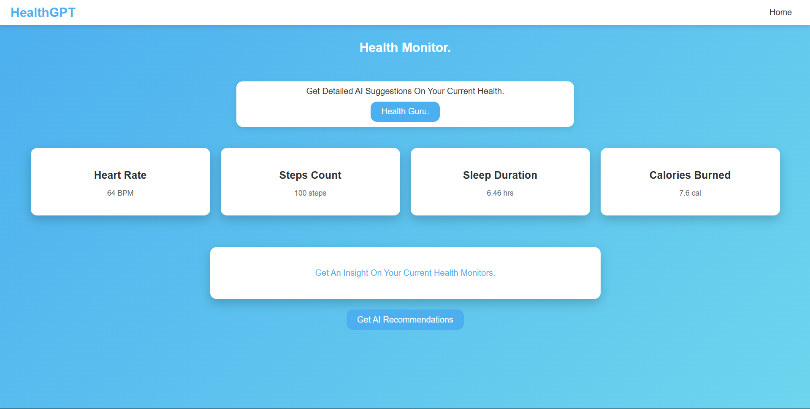

HealthGPT(AI Response Web-UI)

HealthGPT is a comprehensive web application designed for health monitoring and analysis, combining modern web technologies, AI-driven insights, and an intuitive user interface. It enables users to track vital metrics, provide additional health data, and receive personalized health recommendations.

---

Features

Real-Time Health Monitoring
- Tracks key health metrics such as heart rate, steps count, sleep duration, and calories burned.
- Dynamically fetches and displays data in an intuitive and user-friendly layout.

AI-Powered Recommendations
- Utilizes AI to generate tailored health suggestions based on user-provided data.
- Offers actionable advice on lifestyle changes, symptom management, and preventive care.

Interactive Input Form
- Captures detailed health information, including:
  - Medical history
  - Lifestyle habits
  - Symptoms and specific health concerns
- Enables personalized AI analysis by gathering context-rich data.

---

Technologies Used

Frontend
- **HTML5, CSS3, JavaScript**: Responsive design and interactive components.
- **Dynamic Forms**: Interactive and user-friendly for gathering additional data.

Backend
- **Flask Framework**: Powers the server-side application and API endpoints.
- **Flask-CORS**: Enables cross-origin resource sharing for seamless frontend-backend communication.

AI Integration
- **Google Generative AI API**: Leverages Google's `gemini-1.5-pro-latest` model to process prompts and provide tailored insights.

---

Files

1. `index.html`
- The main frontend interface with interactive cards and forms.
- Includes styled sections for real-time metric display, hidden forms, and AI responses.

2. `backend.js`
- Handles fetching and displaying health metrics from CSV files.
- Dynamically updates the health data in the frontend.
- Processes user-provided inputs for generating AI prompts.

3. `backend.py`
- Flask server application managing API routes and data exchange.
- Communicates with the Google Generative AI API to generate health insights.
- Serves static files like JavaScript and the main HTML page.

---

Installation and Setup

Prerequisites
- Python 3.7+
- Flask and Flask-CORS
- A valid Google API key with access to the Generative AI API

Steps
1. Clone the repository:
   ```bash
   git clone https://github.com/yourusername/HealthGPT.git
   cd HealthGPT
   ```

2. Install dependencies:
   ```bash
   pip install flask flask-cors google-generativeai
   ```

3. Set up your Google API key in `backend.py`:
   ```python
   GOOGLE_API_KEY = "your-google-api-key"
   ```

4. Run the Flask server:
   ```bash
   python backend.py
   ```
   

5. Open the application in your browser:
   ```
   http://127.0.0.1:5000
   ```
   

---

Usage
1. View real-time health metrics on the dashboard.
2. Fill out the "Additional Details" form with your medical and lifestyle data.
3. Click "Get AI Recommendations" to receive tailored health insights.

---

Future Enhancements
- Integration with wearable devices for automatic data fetching.
- Improved data visualization using advanced charts and graphs.
- Multi-language support for global accessibility.

---

License
This project is licensed under the [MIT License](LICENSE).

